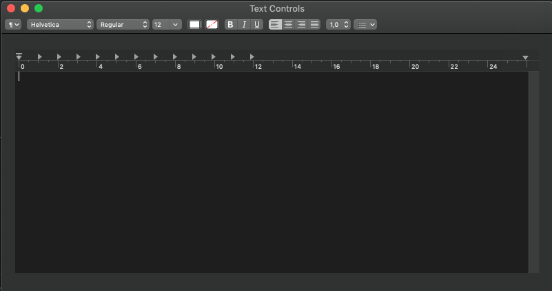

# Text Controls for macOS Programming

A demo project showing you how to work with text controls to build a simple text editing app for macOS. For the full tutorial, please refer to the following link:

https://www.appcoda.com/macos-programming-text-controls
